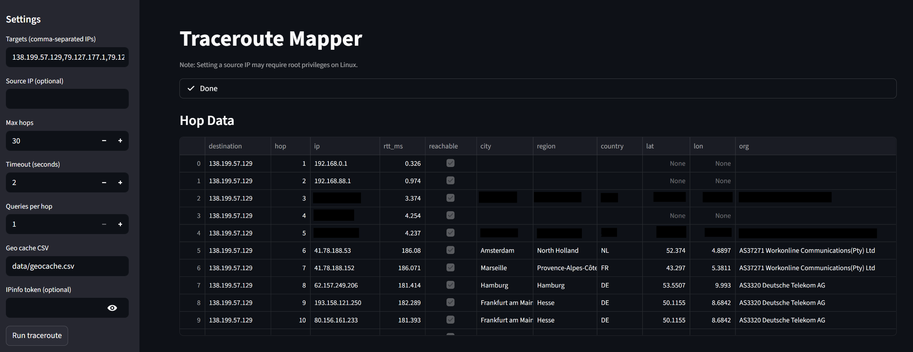
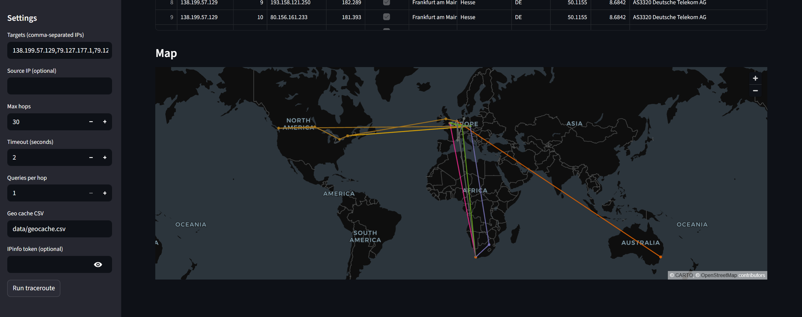

# Traceroute Mapper

CLI + Streamlit app that runs traceroute to multiple destination IPs, geolocates the hops via IPinfo, outputs CSV, and renders a world map.

## Prereqs
- Linux
- `traceroute` installed
  - Debian/Ubuntu: `sudo apt-get install traceroute`
- Python 3.9+
- Optional: IPinfo token (set `IPINFO_TOKEN` env var) for higher rate limits

## Install
```bash
python -m venv .venv
source .venv/bin/activate
pip install -r requirements.txt
```

## CLI
```bash
python tracert_mapper.py \
  --targets "8.8.8.8,1.1.1.1" \
  --source "192.168.88.1" \
  --out-csv traceroute.csv
```

Notes:
- `--source` may require root privileges depending on your system and traceroute build.
- Geolocation results are cached in `data/geocache.csv` by default.

## Streamlit UI
```bash
streamlit run app.py
```

## Screenshots



## Output CSV columns
- `destination`, `hop`, `ip`, `rtt_ms`, `reachable`, `city`, `region`, `country`, `lat`, `lon`, `org`

## Environment
- `IPINFO_TOKEN`: optional. If set, it is used by both the CLI and Streamlit app.


## Canada
- Toronto: 138.199.57.129
- Montréal: 79.127.177.1
- Vancouver: 79.127.233.65

## Europe
- eu-west (Dublin): 87.249.137.8
- eu-central (Frankfurt): 185.102.219.93

- Johannesburg: 169.150.238.161
- London: 185.59.221.51
- Sydney: 143.244.63.144
